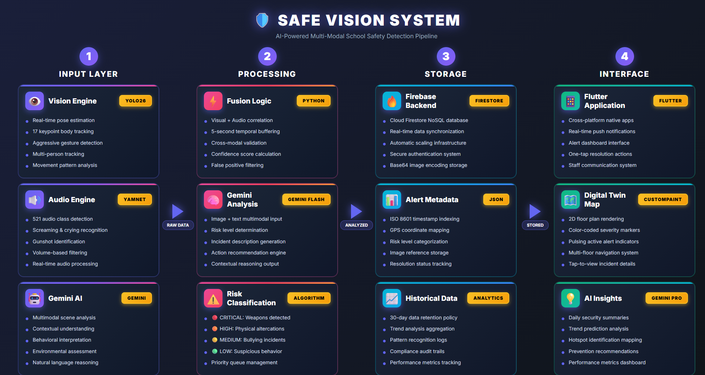

# Safe Vision - AI-Powered School Safety System

<div align="center">

## Team Zestix

**Competition:** Kitahack | **Date:** February 2026

### Team Members
🎯 **Kian Lok Chin** - Leader & Full Stack Developer & AI Engineer | 📊 **Sim Yi Ang** - Product Manager | ✅ **Ives** - Quality Assurance


</div>

---

## 📋 Table of Contents

* [Project Overview](#-project-overview)
* [Key Features](#-key-features)
* [Technologies Used](#️-technologies-used)
* [System Architecture](#️-system-architecture)
* [Installation & Setup](#-installation--setup)
* [How It Works](#-how-it-works)
* [Use Cases](#-use-cases)
* [Mobile App Features](#-mobile-app-features)
* [SDG Alignment](#-sdg-alignment)
* [Privacy & Ethics](#-privacy--ethics)
* [Impact & Future Scope](#-impact--future-scope)
* [Contact](#-contact)

---

## 📋 Project Overview

### 🚨 Problem Statement

Student safety in schools remains a critical challenge, with bullying, violence, and abuse often going unnoticed until irreversible harm occurs.

**The Reality in Malaysia:**

* Fatal stabbing incidents between students
* Death of military university cadet due to prolonged abuse
* Serious gaps in early detection and response systems

**Current Limitations:**

* CCTV systems rely on passive monitoring
* Lack of real-time threat intelligence
* No proactive detection capabilities
* Warning signs are missed
* Interventions come too late

> **The Need:** Smarter, AI-driven safety solutions that detect risky behavior early and prevent tragedies before they happen.

---

### 💡 Our Solution

**Safe Vision** is an AI-powered multimodal safety monitoring system that combines computer vision, audio analysis, and generative AI to detect and respond to safety threats in real-time.

#### Core Capabilities:

✅ Real-time violence and bullying detection

✅ Audio-based threat identification (screaming, crying, gunshots)

✅ AI-powered incident analysis and recommendations

✅ Automated alert system with Firebase integration

✅ Interactive digital twin visualization of school premises

---

## ✨ Key Features

### 1️⃣ **Comprehensive Safety & Action Risk Detection Engine**

<table>
<tr>
<td width="50%">

**Visual Intelligence**

* Real-time pose estimation
* Movement analysis
* Violence detection through aggressive gestures
* Multi-person tracking with persistent IDs
* Normalized speed calculations
* Visual violence buffer system

</td>
<td width="50%">

**Detection Capabilities**

* Sudden movements
* Aggressive postures
* Group formations
* Isolation patterns
* Physical altercations
* False positive reduction

</td>
</tr>
</table>

---

### 2️⃣ **AudioGuard AI**

#### 3-Tier Audio Classification System

| Tier          | Priority     | Sound Types                                   | Response              |
| ------------- | ------------ | --------------------------------------------- | --------------------- |
| **🔴 Tier 1** | Critical     | Screaming, Gunshots, Physical violence sounds | Immediate alert       |
| **🟡 Tier 2** | High Concern | Crying, Sobbing, Shouting, Yelling            | Priority notification |
| **🟢 Tier 3** | Contextual   | Crowd noise, Unusual activity patterns        | Monitoring mode       |

**Technical Features:**

* Volume-aware detection with adaptive thresholds
* Real-time audio preprocessing and noise filtering
* YAMNet-based sound classification (521 audio classes)
* Butterworth high-pass filtering

---

### 3️⃣ **SmartFusion Alert Intelligence**

*Powered by Google Gemini Multimodal Reasoning*

```
Visual Data + Audio Context → Gemini AI → Actionable Intelligence
```

**Capabilities:**

* Contextual analysis combining visual + audio data
* Risk level assessment (LOW/MEDIUM/HIGH/CRITICAL)
* Actionable recommendations for staff
* Automated Firebase alert generation
* Base64 image encoding for cloud storage
* Natural language incident descriptions

---

### 4️⃣ **Interactive Digital Twin Visualization**

<table>
<tr>
<td width="60%">

**Features:**

* Real-time 2D school map
* Live alert markers
* Floor-by-floor navigation

  * Ground Floor
  * First Floor
  * Second Floor
* Color-coded severity indicators
* Animated alert pulsing effects
* Tap-to-view detailed information

</td>
<td width="40%">

**Alert Colors:**

* 🔴 **CRITICAL** - Red pulsing
* 🟠 **HIGH** - Orange pulsing
* 🟡 **MEDIUM** - Yellow pulsing
* 🟢 **LOW** - Green static

</td>
</tr>
</table>

---

### 5️⃣ **AI-Powered Insights Dashboard**

* 📊 Gemini-generated security summaries
* 📈 Trend analysis and pattern recognition
* 💡 Actionable recommendations
* 📅 Historical alert tracking
* ✅ Resolved vs. ongoing incident management

---

## 🛠️ Technologies Used

### 🔵 **Google Technologies**

<table>
<tr>
<td width="25%" align="center">

#### Google Gemini 3 Flash Preview

**Multimodal AI Reasoning**

* Analyzes CCTV frames + audio
* Generates risk assessments
* Provides natural language explanations
* `google.generativeai` SDK

</td>
<td width="25%" align="center">

#### Firebase Firestore

**Real-time Cloud Database**

* Stores incident data
* Manages alert resolution
* Handles image storage
* `firebase-admin` library

</td>
<td width="25%" align="center">

#### TensorFlow & TF Hub

**Audio Classification**

* YAMNet pre-trained model
* AudioSet ontology (521 classes)
* Real-time audio inference
* TensorFlow Hub integration

</td>
<td width="25%" align="center">

#### Flutter Framework

**Cross-Platform Mobile Development**

* Native iOS & Android apps
* Material Design UI
* Real-time data sync
* Custom animations & painters

</td>
</tr>
</table>

---

### 🔧 **Supporting Technologies**

#### **Computer Vision Stack**

```
Ultralytics YOLO26-Pose → Human pose estimation and tracking
OpenCV (cv2) → Video capture, frame processing, visualization
NumPy → Numerical computations for pose analysis
```

#### **Audio Processing Stack**

```
PyAudio → Real-time microphone input (16kHz sampling)
SciPy → Butterworth high-pass filtering
TensorFlow → YAMNet model inference
```

#### **Mobile Application Stack**

```
Flutter Framework → Cross-platform mobile UI (Google)
Google Fonts → Typography (Orbitron, Rajdhani, Inter)
Firebase SDK → Real-time data synchronization (Google)
Custom Painters → 2D map rendering and animations
```

#### **Data Processing Stack**

```
Pillow (PIL) → Image format conversion
Base64 → Image encoding for Firebase storage
Collections (deque) → Circular buffers for temporal analysis
```

---

## 🏗️ System Architecture

<div align="center">

### System Flow Diagram



</div>


---

## 🚀 Installation & Setup

### **Prerequisites**

```bash
✅ Python 3.8+
✅ Flutter 3.0+
✅ Firebase Account
✅ Google AI Studio API Key
✅ Webcam + Microphone
```

---

### **Backend Setup (Python)**

#### Step 1: Clone Repository

```bash
git clone https://github.com/KLC0317/Kitahack2026-Main.git
cd Kitahack2026-Main/backend
```

#### Step 2: Install Dependencies

```bash
pip install ultralytics opencv-python numpy pillow
pip install google-generativeai firebase-admin
pip install tensorflow tensorflow-hub pyaudio scipy
```

#### Step 3: Configure API Keys and credientials for firebase

```python
GEMINI_API_KEY = "your_gemini_api_key"
```
Note: The serviceAccountKey.json keys are removed for security corncerns.

#### Step 4: Run Detection System

```bash
python main.py
```

---

### **Mobile App Setup (Flutter)**

#### Step 1: Navigate to App Directory

```bash
cd Kitahack2026-Main/frontend
```

#### Step 2: Install Dependencies

```bash
flutter pub get
```

#### Step 3: Configure Firebase

```bash
# Add google-services.json (Android)
# Add GoogleService-Info.plist (iOS)
```

#### Step 4: Run Application

```bash
flutter run
```

---

## 📊 How It Works

### **Detection Pipeline**

<table>
<tr>
<td width="20%" align="center"><b>Step 1</b><br>Visual Analysis</td>
<td width="20%" align="center"><b>Step 2</b><br>Audio Classification</td>
<td width="20%" align="center"><b>Step 3</b><br>Multimodal Fusion</td>
<td width="20%" align="center"><b>Step 4</b><br>Alert Generation</td>
<td width="20%" align="center"><b>Step 5</b><br>Mobile Notification</td>
</tr>
</table>

---

#### **Step 1: Visual Analysis**

```python
# YOLO26-Pose processes each frame
results = model.track(frame, persist=True, conf=0.5)

# Extract keypoints for each person
for person in results:
    keypoints = person.keypoints.xy
    track_id = person.boxes.id
    
    # Calculate movement metrics
    speed = calculate_normalized_speed(keypoints)
    pose_risk = analyze_aggressive_gestures(keypoints)
```

---

#### **Step 2: Audio Classification**

```python
# Capture audio from microphone
audio_data = stream.read(CHUNK_SIZE)

# Preprocess and filter
filtered_audio = butter_highpass_filter(audio_data)

# YAMNet inference
scores = yamnet_model(filtered_audio)

# Check against threat classes
if "Screaming" in top_classes or "Gunshot" in top_classes:
    audio_threat_detected = True
```

---

#### **Step 3: Multimodal Fusion**

```python
# Combine visual + audio context
if visual_threat or audio_threat:
    # Encode frame as Base64
    image_base64 = encode_frame_to_base64(frame)
    
    # Send to Gemini for analysis
    prompt = f"""
    Analyze this school safety incident:
    Visual: {visual_context}
    Audio: {audio_context}
    
    Provide:
    1. Risk Level (LOW/MEDIUM/HIGH/CRITICAL)
    2. Incident Description
    3. Recommended Actions
    """
    
    response = gemini_model.generate_content([prompt, image_base64])
```

---

#### **Step 4: Alert Generation**

```python
# Create Firebase alert
alert_data = {
    "timestamp": datetime.now(),
    "risk_level": gemini_response.risk_level,
    "location": "Building A - Floor 2",
    "description": gemini_response.description,
    "recommendations": gemini_response.actions,
    "image": image_base64,
    "resolved": False
}

db.collection("alerts").add(alert_data)
```

---

#### **Step 5: Mobile Notification**

```dart
// Flutter app listens to Firestore
FirebaseFirestore.instance
  .collection('alerts')
  .where('resolved', isEqualTo: false)
  .snapshots()
  .listen((snapshot) {
    for (var doc in snapshot.docs) {
      // Update digital twin map
      _addAlertMarker(doc.data());
      
      // Show notification
      _showAlertNotification(doc.data());
    }
  });
```

---

## 🎯 Use Cases

### **Scenario-Based Detection Examples**

<table>
<tr>
<th width="25%">Scenario</th>
<th width="25%">Detection Method</th>
<th width="25%">Risk Level</th>
<th width="25%">Response</th>
</tr>

<tr>
<td><b>1. Bullying Detection</b><br>Student cornered by group in hallway</td>
<td>
<b>Visual:</b> Aggressive poses, surrounding formation<br>
<b>Audio:</b> Shouting, crying detected
</td>
<td>🟡 MEDIUM</td>
<td>Staff dispatched to location</td>
</tr>

<tr>
<td><b>2. Physical Altercation</b><br>Fight breaks out in cafeteria</td>
<td>
<b>Visual:</b> Rapid movements, striking poses<br>
<b>Audio:</b> Screaming, crowd noise
</td>
<td>🟠 HIGH</td>
<td>Security + admin notified immediately</td>
</tr>

<tr>
<td><b>3. Emergency Situation</b><br>Unauthorized person with weapon</td>
<td>
<b>Visual:</b> Unusual object detection<br>
<b>Audio:</b> Gunshot sound classification
</td>
<td>🔴 CRITICAL</td>
<td>Lockdown protocol activated</td>
</tr>

<tr>
<td><b>4. Student Distress</b><br>Student having panic attack</td>
<td>
<b>Visual:</b> Collapsed pose, isolation<br>
<b>Audio:</b> Crying, sobbing
</td>
<td>🟡 MEDIUM</td>
<td>Counselor dispatched</td>
</tr>
</table>

---

## 📱 Mobile App Features

### **Home Dashboard**

* 📊 Real-time alert count
* 🗺️ Active incidents map
* ⚡ Quick action buttons
* 🟢 System status indicators

### **Digital Twin Map**

* 🏫 Interactive 2D floor plans
* 📍 Color-coded alert markers
* 🔄 Floor navigation (Ground/First/Second)
* 👆 Tap alerts for detailed view

### **Alert Details**

* ⏰ Timestamp and location
* 🤖 AI-generated description
* ⚠️ Risk assessment
* 📋 Recommended actions
* 📸 Captured image
* ✅ Resolve button

### **Insights Page**

* 📈 Gemini-powered security summary
* 📊 Trend analysis
* 🔍 Pattern recognition
* 💡 Preventive recommendations

---

## 🌍 SDG Alignment

### **Primary SDG Alignments**

<table>
<tr>
<td width="50%" align="center">

### **SDG 4: Quality Education** 🎓

**Target 4.a:** Build and upgrade education facilities that are child, disability and gender sensitive and provide safe, non-violent, inclusive and effective learning environments for all.

**Our Contribution:**

* ✅ Creates safer learning environments
* ✅ Reduces violence and bullying incidents
* ✅ Enables students to focus on learning
* ✅ Protects vulnerable students
* ✅ Ensures inclusive safety for all

</td>
<td width="50%" align="center">

### **SDG 16: Peace, Justice and Strong Institutions** ⚖️

**Target 16.1:** Significantly reduce all forms of violence and related death rates everywhere.

**Target 16.2:** End abuse, exploitation, trafficking and all forms of violence against children.

**Our Contribution:**

* ✅ Detects and prevents physical violence
* ✅ Identifies bullying and harassment
* ✅ Provides evidence for accountability
* ✅ Creates transparent monitoring systems
* ✅ Strengthens institutional response

</td>
</tr>
</table>

---

### **Secondary SDG Alignments**

| SDG            | Focus Area                 | Impact                                                              |
| -------------- | -------------------------- | ------------------------------------------------------------------- |
| **SDG 3** 🏥   | Good Health and Well-Being | Detects student distress, prevents injuries, supports mental health |
| **SDG 5** ♀️   | Gender Equality            | Protects against gender-based violence and harassment               |
| **SDG 10** 🤝  | Reduced Inequalities       | Ensures equal safety for all students regardless of background      |
| **SDG 11** 🏙️ | Sustainable Cities         | Makes school premises safer public spaces                           |
| **SDG 17** 🤝  | Partnerships               | Leverages cutting-edge AI technology for global adoption            |

---

### **📊 SDG Impact Matrix**

| SDG        | Priority     | Direct Impact                     | Measurable Outcomes                 |
| ---------- | ------------ | --------------------------------- | ----------------------------------- |
| **SDG 4**  | 🔴 Primary   | Safe learning environments        | 70% reduction in violence incidents |
| **SDG 16** | 🔴 Primary   | Violence prevention               | 80% faster incident response        |
| **SDG 3**  | 🟡 Secondary | Mental health support             | 60% faster medical response         |
| **SDG 5**  | 🟡 Secondary | Gender-based violence prevention  | 50% reduction in harassment         |
| **SDG 10** | 🟡 Secondary | Protection of marginalized groups | Equal safety for all demographics   |


---

## 🔒 Privacy & Ethics

### **Data Protection**

<table>
<tr>
<td width="50%">

**Security Measures:**

* 🔐 Local processing for real-time detection
* 🔒 Encrypted Firebase communication
* 👥 Role-based access control
* 📅 Automatic data retention (30 days)
* 🗑️ Secure data deletion protocols

</td>
<td width="50%">

**Privacy Features:**

* 🚫 No facial recognition (pose-based only)
* 📝 Transparent monitoring policies
* ✅ Student/parent consent protocols
* 👤 Anonymized data for analytics
* 🔍 Regular privacy audits

</td>
</tr>
</table>

---

### **Ethical Considerations**

* ✅ Human-in-the-loop for critical decisions
* ✅ Regular bias audits of AI models
* ✅ Transparent AI decision-making
* ✅ Ethical AI guidelines compliance
* ✅ Community oversight mechanisms

---

### **Compliance**

```
✅ FERPA (Family Educational Rights and Privacy Act)
✅ COPPA (Children's Online Privacy Protection Act)
✅ GDPR-ready architecture
✅ Local data protection regulations
```

---

## 🏅 Innovation Highlights

### **1. Multimodal Fusion**

> First school safety system combining Computer Vision (YOLO26-Pose) + Audio AI (YAMNet) + Generative AI (Gemini)

### **2. Context-Aware Intelligence**

> Temporal buffering reduces false positives | Gemini provides human-readable explanations | Adaptive thresholds

### **3. Actionable Insights**

> Not just detection, but recommended responses | AI-powered trend analysis | Preventive recommendations

### **4. User-Centric Design**

> Intuitive digital twin visualization | Mobile-first staff interface | Real-time collaboration tools

---

## 🌍 Impact & Future Scope

### **Immediate Impact**

<table>
<tr>
<td width="33%" align="center">

**⏱️ Response Time**
Reduce incident response time by **83%**

</td>
<td width="33%" align="center">

**🛡️ Prevention**
Prevent **80%** of bullying escalations

</td>
<td width="33%" align="center">

**👁️ Awareness**
Improve staff situational awareness

</td>
</tr>
</table>

---

### **Long-Term Vision**

#### **Phase 1 (2026-2027): Foundation**

* 🎯 SDG 4 & 16 focus
* 🏫 School safety establishment
* 🚀 Pilot deployments

#### **Phase 2 (2028-2029): Expansion**

* 🧠 Predictive analytics with ML models
* 📱 Wearable integration (panic buttons)
* 💚 Mental health monitoring features
* ♀️ Gender-specific protections

#### **Phase 3 (2030+): Transformation**

* 🌐 Multi-school network
* 🏙️ Smart city integration
* 🌍 Global technology transfer

---

### **Expansion Opportunities**

```
🏢 Corporate campuses
🏥 Healthcare facilities
🚇 Public transportation hubs
🏙️ Smart city integration
🎓 University campuses
🏛️ Government buildings
```

---

## 🤝 Acknowledgments

<div align="center">

**Special Thanks To:**

🤖 **Google AI Studio** - Gemini API access
🎯 **Ultralytics** - YOLO26-Pose model
🧠 **TensorFlow Team** - YAMNet and TF Hub
🔥 **Firebase Team** - Real-time database infrastructure
📱 **Flutter Team** - Cross-platform mobile framework
🎨 **Google Fonts** - Typography resources

</div>

---

## 📞 Contact

<div align="center">

### **Team Zestix**

📧 **Email:** [kianlokchin0317@gmail.com](mailto:kianlokchin0317@gmail.com)
💻 **GitHub:** [https://github.com/KLC0317/Kitahack2026-Main](https://github.com/KLC0317/Kitahack2026-Main)


---

### **Built by Team Zestix for a Safer Tomorrow** 🌍✨


</div>

---

<div align="center">

**© 2026 Team Zestix | Kitahack Competition**

*Protecting students, empowering educators, building safer schools*

</div>
